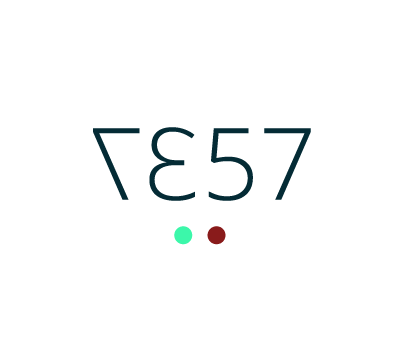

testardo
===============================================================
  a browser and OS agnostic web driver for mobile and desktop

### in a nutshell
Bored to death to swipe around in order to be sure device X still works? If so, give _testardo_ a chance!

_testardo_ is the easiest way to test your local projects with some remote service testing capabilities too.
You can be notified if something goes wrong, you can change tests at runtime and have an instant update for all running devices, you can forget SDKs, special software, drivers, patches and fixes ... you create the test with everything you know and need already with the ability to include libraries and utilities at runtime.

**testardo** will be instantly useful thanks to its status colors on any device display: green for success, yellow if the server is offline, red when there was an error and with shown error info ... as easy as that!

### how to
To use _testardo_ ... all you need is the [testardo](build/testardo) file. Grab it or simply install it via `npm install -g testardo`.

The executable will create a testing environment showing the URL to load through your device browser.
As long as your Mac/Linux machine is reachable through the same network there's really nothing else to do.

If you want to have an idea of _testardo_ options at launch time, please check the [how-to](src/server/how-to.js) file, or launch `./testardo` without arguments in your console.

#### API
The documentation for the client is [commented in this file](https://github.com/WebReflection/testardo/blob/master/src/client/sandbox.js), that is the `sandbox` object every test receives.

For the server, just write `testardo` to know options.

### basic HTTPS support
Landed in version `0.2.x` basic HTTPS support, i.e. `testardo --host=webreflection.github.io --https examples/eddy.js`

### grunt plugin
A huge thank to [@gianlucaguarini](https://twitter.com/gianlucaguarini) for his [grunt-testardo](https://github.com/GianlucaGuarini/grunt-testardo#grunt-testardo-) plugin.

#### example
A very basic example is shown in [this file](examples/google-search.js).

Write `./testardo --host=google.com --loop=0 examples/google-search.js` and connect to the full url shown in the terminal.
This will look something like: `en1: http://192.168.1.146:7357/$` where the full url to connect to will be `http://192.168.1.146:7357/$`

#### original post + live demo
If you want to know more and see a video about _testardo_ feel free to reach [the original post in my blog](http://webreflection.blogspot.com/2014/01/testardo-browser-agnostic-js-web-driver.html)

### compatibility
So far, _testardo_ has been tested with the following **Mobile** browsers:

  * iOS 5.1 and greater
  * Android 2.3 and greater
  * Opera Mobile Classic
  * Firefox OS 1.0 and greater
  * Windows Phone 7 and greater
  * Blackberry 10
  * Kindle Fire Silk
  * webOS (the one for the old palm pre, not yet LG TVs)

Above list will change as soon as new devices will be tested.

The list of compatible and tested **Desktop** browsers:

  * Chrome
  * Firefox
  * Opera
  * Safari

Above list will change as soon as different browsers will be tested.

Ideally old IE browsers should work too (at some point).

### why
Selenium is cool but there's no selenium for platforms different from Android and iOS.
This makes integration tests extremely painful for all other phones, both newer and older.

_testardo_ would like to simplify one-shot or infinitely repeated integration tests with any browser you would like to test.

### TODO

  * ~~https and SSL compatibility~~ (basic support for https landed in 0.2.x)
  * more sandbox shortcuts/utilities
  * more Desktop browsers to test
  * more Mobile browsers/devices too

Any help will be more than appreciated.

### F.A.Q.

  * **wasn't [Karma](http://karma-runner.github.io/) or <-- put another project name here --> doing already this ?** NO, by time I've written `./testardo` there was not a single alternative for cross browser and cross OS integration tests. However, and ironically if you want, you could run `Karma` inside `testardo` if you think your unit test framework needs to be tested through integrations with browsers or devices ... go crazy with all sort of tests as long as you test something in a meaningful way ;-)
  * **what does _testardo_ mean ?** in Italian, _testardo_ means stubborn and it plays well in English because of the _test_ part of the word, and the _hard_ like sound too which properly represents the current status of mobile web testing and development.
  * **why a single JS file with everything and no dependencies ?** assume for a second you don't have `npm` but just some version of node and you still want that machine to be able to be the server for a rack of testing devices ... _testardo_ wants to be a **zero config** and **zer stress** solution as agnostic as possible on the server side too. Creating a single JS file that is used for both the server and the client part was also a very interesting achievement many talked about before, few did in a concrete way as _testardo_ does :-)
  * **is _testardo_ compatible with <-- put your library name here --> ?** YES, testardo simply creates the sandboxed environment and the proxy logic to _zombify_ your devices but it does not pollute at all the surrounding env with any library. The `sandbox` is rather an utility you can feel free to not use or ignore, passing through the provided `window` or `document` arguments.
  * **what's with port 7357 ?** if you replace the number `7357` with similar capital letters where `7 == T`, `3 == E`, and `5 == S`, you'll realize such port is the easiest to remember ever for TEST purposes
